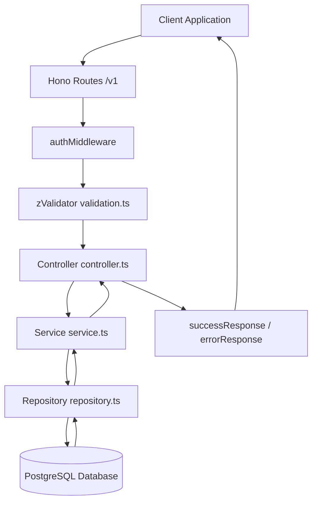

# System Architecture

The EBizHub backend follows a Feature-Driven Development (FDD) design pattern, separating concerns cleanly to maximize testability and encapsulation.

---

## 🔄 Request Flow Lifecycle

When a client sends a request to the backend, it flows through the following layers:

---

## 🏛️ Layer Responsibilities

* **Routes (`routes.ts`)**: Registers endpoints under standard path mappings. Mounts middleware such as `authMiddleware` or `requireRole`.
* **Controller (`controller.ts`)**: Decouples HTTP transport from business logic. Parses parameters from Hono context (`c.req.param`, `c.req.query`, or JSON body), invokes Zod validators, and formats output using shared response helpers.
* **Service (`service.ts`)**: Contains pure business rules, validation assertions (e.g. enforcing max 5 products cap, verifying resource availability), ownership evaluations, and transaction coordination.
* **Repository (`repository.ts`)**: Houses database queries using Drizzle ORM query builders. Directly interacts with Drizzle tables.
* **Validation (`validation.ts`)**: Declares strict Zod schemas for input filtering and param sanitation.
* **Middlewares (`/shared/middleware/`)**:
  * `authMiddleware`: Extracts Bearer token, verifies against Supabase Auth, fetches the `profile`, and attaches `user`, `profile`, and `role` to the context.
  * `requireRole`: Ensures the active context role matches required admin/vendor privileges.
* **Responses (`/shared/responses/response.ts`)**:
  * `successResponse`: Standardizes successful JSON payload formats.
  * `errorResponse`: Standardizes error message structures.
