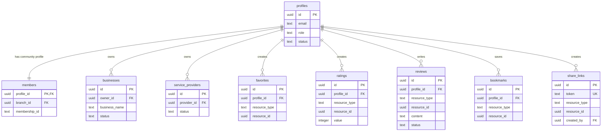

# Database Schema Reference

The database engine is PostgreSQL. Schema generation and migration mapping are handled via Drizzle ORM.

---

## 🗺️ Entity Relationship Overview

The following relationship map shows how primary entities (members, businesses, service providers) tie into engagement modules (ratings, reviews, bookmarks, share links, favorites):

---

## 🗄️ Core Tables Reference

### 1. `profiles`
Tracks authenticated identities synchronized with Supabase.
* **Fields**: `id` (UUID PK), `email` (text), `role` (text enum: `admin`, `vendor`, `customer`), `status` (text enum: `active`, `suspended`), `createdAt` (timestamp), `updatedAt` (timestamp).

### 2. `members`
Stores community-specific member properties.
* **Fields**: `profileId` (UUID PK references `profiles.id`), `branchId` (UUID references `branches.id`), `membershipId` (text), `joinedDate` (timestamp), `status` (text).

### 3. `businesses`
Tracks business registrations.
* **Fields**: `id` (UUID PK), `ownerId` (UUID references `profiles.id`), `businessName` (text), `status` (text: `draft`, `pending`, `active`, `suspended`), `createdAt` (timestamp), `deletedAt` (timestamp).

### 4. `service_providers`
Tracks service provider profiles.
* **Fields**: `id` (UUID PK), `providerId` (UUID references `profiles.id`), `status` (text: `draft`, `pending`, `active`, `suspended`), `createdAt` (timestamp), `deletedAt` (timestamp).

### 5. `favorites`
* **Fields**: `id` (UUID PK), `profileId` (UUID references `profiles.id`), `resourceType` (text: `business`, `provider`), `resourceId` (UUID), `createdAt` (timestamp).
* **Indexes**: Unique constraint on `(profileId, resourceType, resourceId)` for duplicate prevention.

### 6. `ratings`
* **Fields**: `id` (UUID PK), `profileId` (UUID references `profiles.id`), `resourceType` (text), `resourceId` (UUID), `value` (integer 1-5), `deletedAt` (timestamp).
* **Indexes**: Unique active index on `(profileId, resourceType, resourceId)` where `deletedAt IS NULL`.

### 7. `reviews`
* **Fields**: `id` (UUID PK), `profileId` (UUID references `profiles.id`), `resourceType` (text), `resourceId` (UUID), `ratingId` (UUID references `ratings.id`), `content` (text), `status` (text: `pending`, `approved`, `rejected`), `deletedAt` (timestamp).

### 8. `bookmarks`
* **Fields**: `id` (UUID PK), `profileId` (UUID references `profiles.id`), `resourceType` (text: `news`, `event`, `job`, `offer`), `resourceId` (UUID), `deletedAt` (timestamp).

### 9. `share_links`
* **Fields**: `id` (UUID PK), `token` (text unique), `resourceType` (text), `resourceId` (UUID), `createdBy` (UUID references `profiles.id`), `clickCount` (integer), `expiresAt` (timestamp), `deletedAt` (timestamp).

---

## 🗑️ Soft-Delete Strategy
Core database tables (`businesses`, `service_providers`, `ratings`, `reviews`, `bookmarks`, `share_links`, `community_news`, `events`, `jobs`, `offers`, `notices`) must not hard-delete records. 

1. Write updates using `deletedAt: new Date()` to soft-delete.
2. Filter active reads using `isNull(table.deletedAt)` in all repositories.
